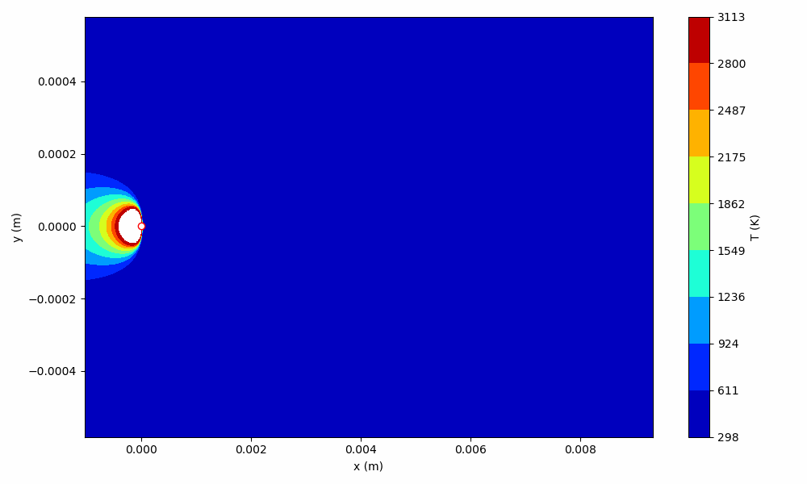
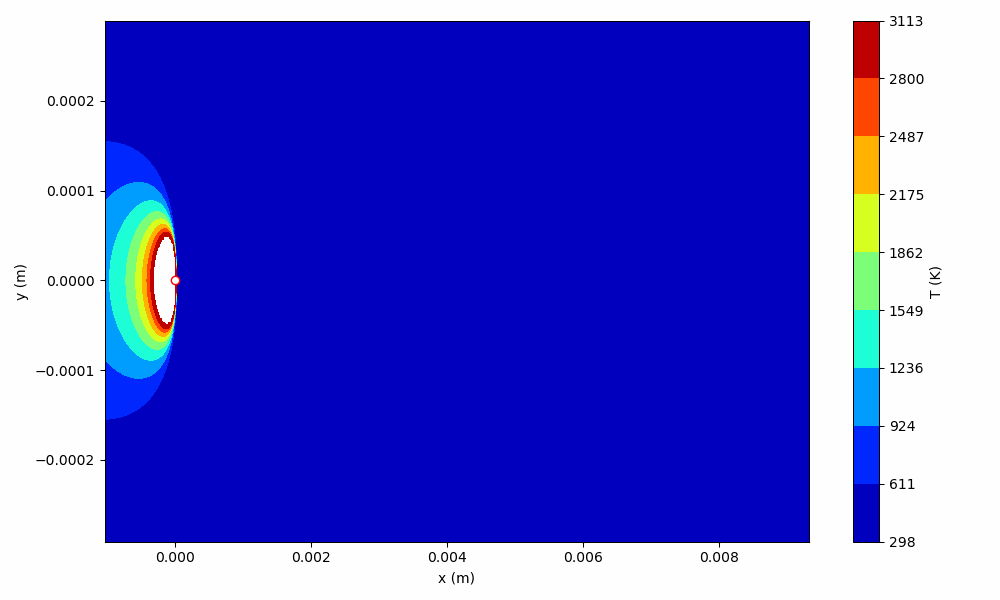
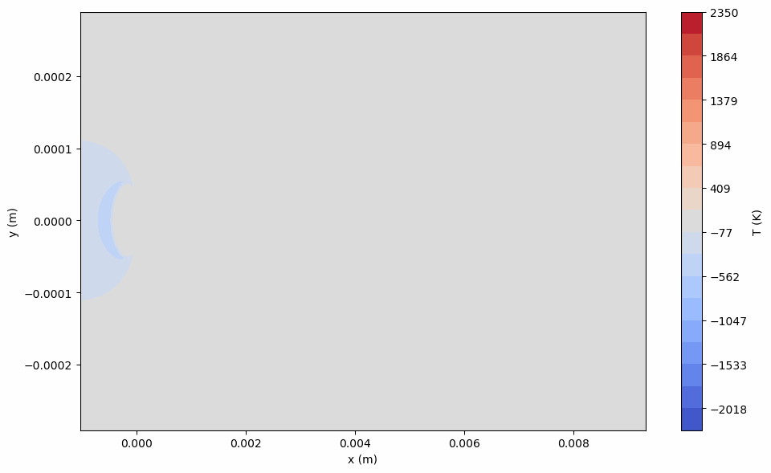

## Efficient inference of stochastic temperature field from melt pool characterization data

## Background
Laser powder bed fusion (LPBF) is a 3D printing technology in which complex, near-net shaped metallic parts can be manufactured without resorting to the expensive logistical and supply chain issues that traditional manufacturing methods would need. However, a significant challenge to adopting these parts in critical applications (aerospace) / extreme environments (nuclear reactors) results from the variability in part performance at the same build conditions. To quantify uncertainty in the process and propagate this uncertainty to part performance, the community has recently shifted towards probabilistic process-structure-property (PSP) models.

## Problem
One of the most intricate facets of probabilistic process modeling is the computational modeling of the heat-transfer and fluid flow of the melting region (melt pool) in LPBF. Recent studies (Khairallah 2016) have shown that the formation of a vapor cavity and spatter particles (fully or partially molten material ejected by the melt pool as the laser rasters over the powder bed) add significant complications to the heat/mass transfer problem formulation. All of these effects must then be considered under uncertainty, making direct numerical simulations of stochastic melt pools in probabilistic PSP models highly intractable on even the largest computing architectures.

In this project (for CE6310: Uncertainty Quantification), I employ a **data-driven approach to estimate  underlying thermophysical property variations in an analytical heat source model based on segmented images from experimental characterization of melt pools in LPBF**. I used a recursive bayesian state estimator (the particle filter) coupled with a quick root-finding method to calibrate temporally varying parameters ensuring that the liquidus contour in the temperature field matched melt pool measurements. This falls under the class of problems known as inverse heat conduction problems, and more generally under inverse problems. 

The writeup and presentation can be found under ./deliverables. Here are some animations showing the calibration results of the model, and the resulting inferred stochastic temperature fields.

Deterministic temperature field (using the OLS solution w.r.t. experimental measurements)
Note that until recently, this was a common way of addressing the melt pool modeling facet of PSP models.

Stochastic temperature field (using particle-filter calibrated estimations of temporally varying thermophysical properties)

Difference in temperature fields (deterministic vs. stochastic)

